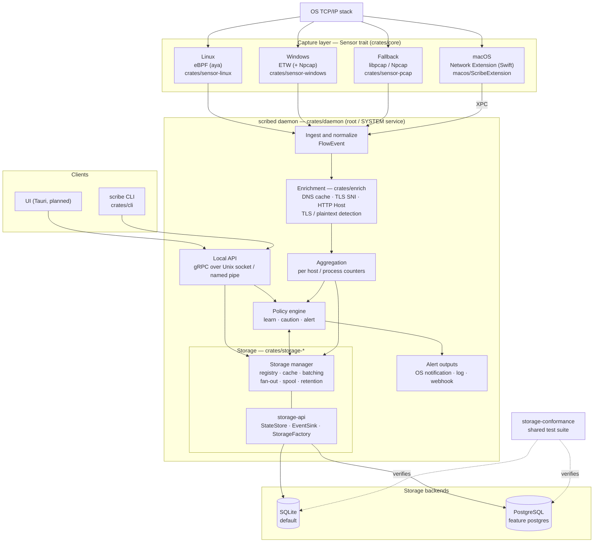
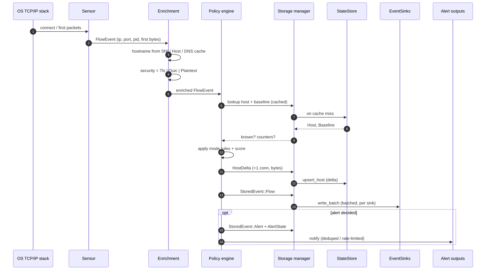
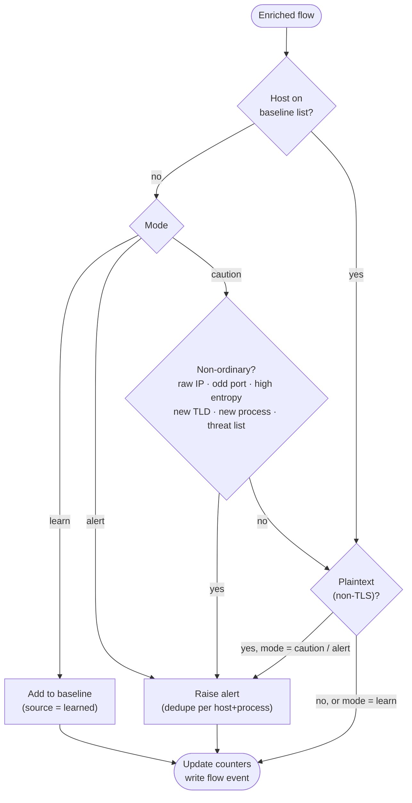
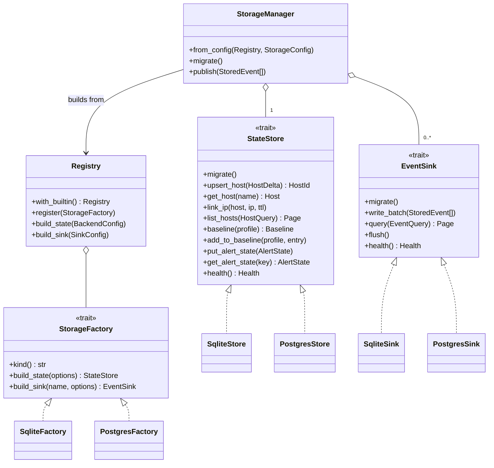

# scribe program diagrams

## 1. Components

```mermaid
flowchart TB
    subgraph clients["Clients"]
        ui["UI (Tauri, planned)"]
        cli["scribe CLI<br/>crates/cli"]
    end

    subgraph daemon["scribed daemon — crates/daemon (root / SYSTEM service)"]
        api["Local API<br/>gRPC over Unix socket / named pipe"]
        ingest["Ingest and normalize<br/>FlowEvent"]
        enrich["Enrichment — crates/enrich<br/>DNS cache · TLS SNI · HTTP Host<br/>TLS / plaintext detection"]
        agg["Aggregation<br/>per host / process counters"]
        policy["Policy engine<br/>learn · caution · alert"]
        alerts["Alert outputs<br/>OS notification · log · webhook"]

        subgraph storage["Storage — crates/storage-*"]
            manager["Storage manager<br/>registry · cache · batching<br/>fan-out · spool · retention"]
            api_traits["storage-api<br/>StateStore · EventSink · StorageFactory"]
        end
    end

    subgraph backends["Storage backends"]
        sqlite[("SQLite<br/>default")]
        pg[("PostgreSQL<br/>feature postgres")]
    end

    conf["storage-conformance<br/>shared test suite"]

    subgraph sensors["Capture layer — Sensor trait (crates/core)"]
        linux["Linux<br/>eBPF (aya)<br/>crates/sensor-linux"]
        win["Windows<br/>ETW (+ Npcap)<br/>crates/sensor-windows"]
        mac["macOS<br/>Network Extension (Swift)<br/>macos/ScribeExtension"]
        pcap["Fallback<br/>libpcap / Npcap<br/>crates/sensor-pcap"]
    end

    kernel["OS TCP/IP stack"]

    ui --> api
    cli --> api
    api --> policy
    api --> manager

    kernel --> linux & win & mac & pcap
    linux & win & pcap --> ingest
    mac -- XPC --> ingest

    ingest --> enrich --> agg --> policy
    policy --> alerts
    policy <--> manager
    agg --> manager
    manager --- api_traits
    api_traits --> sqlite & pg
    conf -. verifies .-> sqlite & pg
```

## 2. Flow of one outgoing connection

```mermaid
sequenceDiagram
    autonumber
    participant K as OS TCP/IP stack
    participant S as Sensor
    participant E as Enrichment
    participant P as Policy engine
    participant M as Storage manager
    participant St as StateStore
    participant Sk as EventSinks
    participant A as Alert outputs

    K->>S: connect / first packets
    S->>E: FlowEvent (ip, port, pid, first bytes)
    E->>E: hostname from SNI / Host / DNS cache
    E->>E: security = Tls | Quic | Plaintext
    E->>P: enriched FlowEvent
    P->>M: lookup host + baseline (cached)
    M->>St: on cache miss
    St-->>M: Host, Baseline
    M-->>P: known? counters?
    P->>P: apply mode rules + score
    P->>M: HostDelta (+1 conn, bytes)
    M->>St: upsert_host (delta)
    P->>M: StoredEvent::Flow
    M->>Sk: write_batch (batched, per sink)
    opt alert decided
        P->>M: StoredEvent::Alert + AlertState
        P->>A: notify (deduped / rate-limited)
    end
```

## 3. Policy mode decision

```mermaid
flowchart TD
    start(["Enriched flow"]) --> listed{"Host on<br/>baseline list?"}

    listed -- no --> mode1{"Mode"}
    mode1 -- learn --> add["Add to baseline<br/>(source = learned)"] --> record
    mode1 -- alert --> raise
    mode1 -- caution --> score{"Non-ordinary?<br/>raw IP · odd port · high entropy<br/>new TLD · new process · threat list"}
    score -- yes --> raise
    score -- no --> plain

    listed -- yes --> plain{"Plaintext<br/>(non-TLS)?"}
    plain -- "yes, mode = caution / alert" --> raise
    plain -- "no, or mode = learn" --> record

    raise["Raise alert<br/>(dedupe per host+process)"] --> record
    record(["Update counters<br/>write flow event"])
```

## 4. Storage plugin structure

```mermaid
classDiagram
    class StorageFactory {
        <<trait>>
        +kind() str
        +build_state(options) StateStore
        +build_sink(name, options) EventSink
    }
    class StateStore {
        <<trait>>
        +migrate()
        +upsert_host(HostDelta) HostId
        +get_host(name) Host
        +link_ip(host, ip, ttl)
        +list_hosts(HostQuery) Page
        +baseline(profile) Baseline
        +add_to_baseline(profile, entry)
        +put_alert_state(AlertState)
        +get_alert_state(key) AlertState
        +health() Health
    }
    class EventSink {
        <<trait>>
        +migrate()
        +write_batch(StoredEvent[])
        +query(EventQuery) Page
        +flush()
        +health() Health
    }
    class Registry {
        +with_builtin() Registry
        +register(StorageFactory)
        +build_state(BackendConfig)
        +build_sink(SinkConfig)
    }
    class StorageManager {
        +from_config(Registry, StorageConfig)
        +migrate()
        +publish(StoredEvent[])
    }

    StorageFactory <|.. SqliteFactory
    StorageFactory <|.. PostgresFactory
    StateStore <|.. SqliteStore
    StateStore <|.. PostgresStore
    EventSink <|.. SqliteSink
    EventSink <|.. PostgresSink
    Registry o-- StorageFactory
    StorageManager --> Registry : builds from
    StorageManager o-- "1" StateStore
    StorageManager o-- "0..*" EventSink
```
